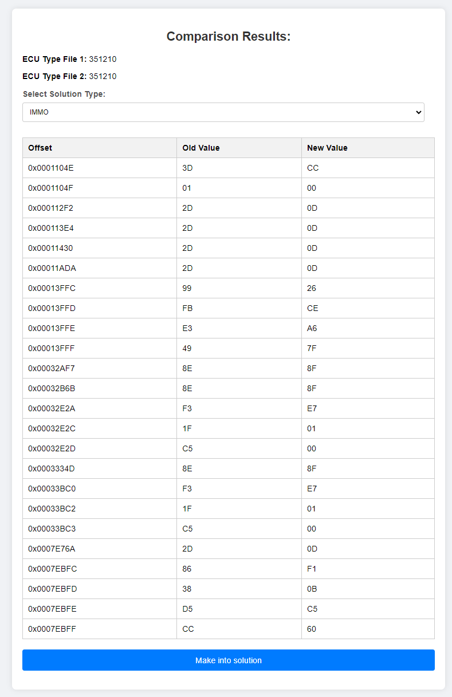

# PHP-ECUcalc
This is a PHP tool to edit binary car files, the only solution added in this project as an example is (Bosch DDE4 sw 351761)

Select ECU type

Upload file

Software version is read and file selected is printed.

Choose solution you want to apply (I selected all solutions listed)
Your result is calculated and you will get warning about missing solutions and what solution is actually applied.

Creator tool

